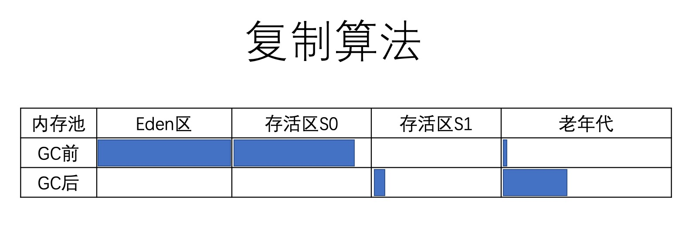
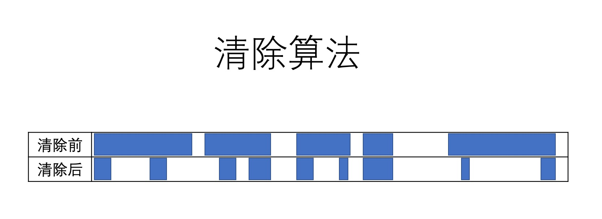
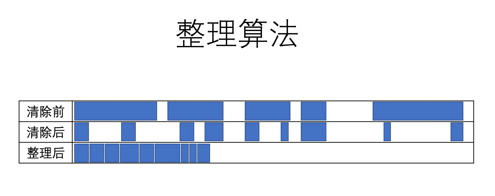
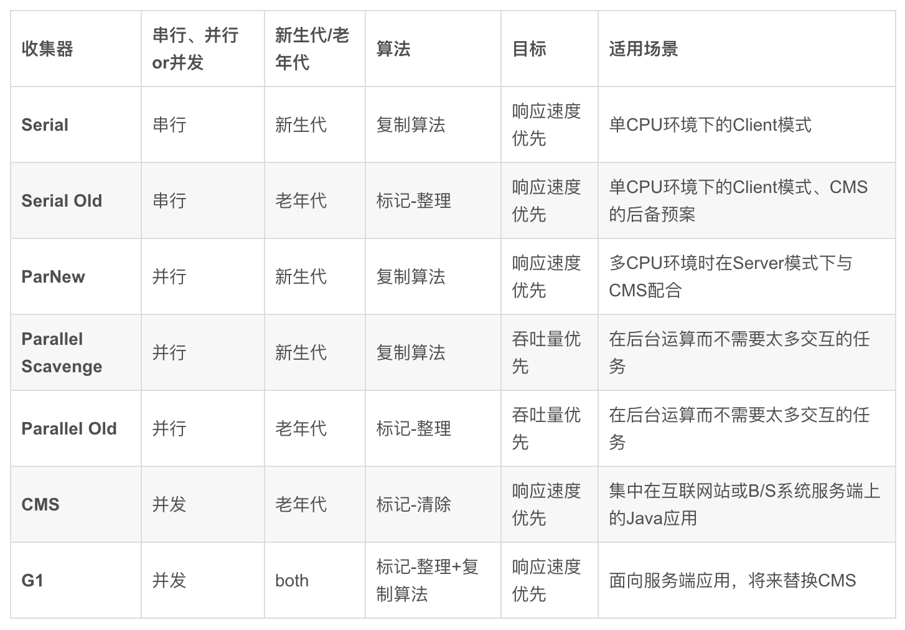

**作业见** *作业目录*

参考文档
1. 深入理解Java虚拟机.pdf 

## 一. 字节码

### 1. 什么是字节码

> Javabytecode由单字节（byte）的指令组成，理论上最多支持256个操作码（opcode）。实际上Java只使用了200左右的操作码，还有一些操作码则保留给调试操作。

根据指令的性质，主要分为四个大类：
1.栈操作指令，包括与局部变量交互的指令2.程序流程控制指令
3.对象操作指令，包括方法调用指令
4.算术运算以及类型转换指令

### 2. 查看字节码

> javap -c -v demo.jvm0104.HelloByteCode

### 3. JVM运行时结构

> JVM是一台基于栈的计算机器。
每个线程都有一个独属于自己的线程栈（JVMStack），用于存储栈帧（Frame）。
每一次方法调用，JVM都会自动创建一个栈帧。
栈帧由操作数栈，局部变量数组以及一个Class引用组成。
Class引用指向当前方法在运行时常量池中对应的Class。

3.1 栈帧(Stack Frame)的局部变量表：存放方法参数和局部变量的内存区域。对于实例方法，slot0存储this，对于静态方法存储参数
>​ java数据类型包括：byte boolean char short int long float double reference(对象引用数据类型，是指向堆内存的引用)

3.2 栈帧(Stack Frame)的局部变量表中的最小单位为slot
> 局部变量表里，32位以内的类型只占用一个slot，64位类型（long和double）占用两个slot。

### 4. JVM数据类型

Java是静态类型的，它会影响字节码指令的设计，这样指令就会期望自己对特定类型的值进行操作。例如，就会有好几个add指令用于两个数字相加：iadd、ladd、fadd、dadd。他们期望类型的操作数分别是int、long、float和double。大多数字节码都有这样的特性，它具有不同形式的相同功能，这取决于操作数类型。
JVM定义的数据类型包括:

1.  基本类型:
    数值类型: byte (8位), short (16位), int (32位), long (64-bit位), char (16位无符号Unicode), float(32-bit IEEE 754 单精度浮点型), double (64-bit IEEE 754 双精度浮点型)
    布尔类型
    指针类型: 指令指针。
2.  引用类型:
    类
    数组
    接口
在字节码中布尔类型的支持是受限的。举例来说，没有结构能直接操作布尔值。布尔值被替换转换成 int 是通过编译器来进行的，并且最终还是被转换成 int 结构。Java 开发者应该熟悉所有上面的类型，除了 returnAddress，它没有等价的编程语言类型。类数组接口在字节码中布尔类型的支持是受限的。举例来说，没有结构能直接操作布尔值。布尔值被替换转换成 int 是通过编译器来进行的，并且最终还是被转换成 int 结构。

Java 开发者应该熟悉所有上面的类型，除了 returnAddress，它没有等价的编程语言类型


### 5. 字节码助记符

https://blog.csdn.net/PacosonSWJTU/article/details/50600128

### 6. 参考文章

https://blog.csdn.net/a15089415104/article/details/83215598

https://zhuanlan.zhihu.com/p/81965927?from_voters_page=true

## 二. JVM加载器

### 1. 类的生命周期

1. 加载（Loading）：找Class文件
2. 验证（Verification）：验证格式、依赖
3. 准备（Preparation）：静态字段、方法表
4. 解析（Resolution）：符号解析为引用
5. 初始化（Initialization）：构造器、静态变量赋值、静态代码块6.使用（Using）
6. 卸载（Unloading）


### 2. 类的加载时机

1. 当虚拟机启动时，初始化用户指定的主类，就是启动执行的 main 方法所在的类；
2. 当遇到用以新建目标类实例的 new 指令时，初始化 new 指令的目标类，就是 new
一个类的时候要初始化；
3. 当遇到调用静态方法的指令时，初始化该静态方法所在的类；
4. 当遇到访问静态字段的指令时，初始化该静态字段所在的类；
5. 子类的初始化会触发父类的初始化；
6. 如果一个接口定义了 default 方法，那么直接实现或者间接实现该接口的类的初始化，
会触发该接口的初始化；
7. 使用反射 API 对某个类进行反射调用时，初始化这个类，其实跟前面一样，反射调用
要么是已经有实例了，要么是静态方法，都需要初始化；
8. 当初次调用 MethodHandle 实例时，初始化该 MethodHandle 指向的方法所在的
类。

### 3. 不会初始化（可能会加载）

1. 通过子类引用父类的静态字段，只会触发父类的初始化，而不会触发子类的初始化。
2. 定义对象数组，不会触发该类的初始化。
3. 常量在编译期间会存入调用类的常量池中，本质上并没有直接引用定义常量的类，不
会触发定义常量所在的类。
4. 通过类名获取 Class 对象，不会触发类的初始化，Hello.class 不会让 Hello 类初始
化。
5. 通过 Class.forName 加载指定类时，如果指定参数 initialize 为 false 时，也不会触
发类初始化，其实这个参数是告诉虚拟机，是否要对类进行初始化。Class.forName
（“jvm.Hello”）默认会加载 Hello 类。
6. 通过 ClassLoader 默认的 loadClass 方法，也不会触发初始化动作（加载了，但是
不初始化）。

### 4. 三类加载器
1. 启动类加载器（BootstrapClassLoader）
2. 扩展类加载器（ExtClassLoader）
3. 应用类加载器（AppClassLoader）


## 三. JVM内存模型

### 1. JVM内存结构

#### 1.1 JVM整体内存结构

>每启动一个线程，JVM 就会在栈空间栈分
配对应的 线程栈, 比如 1MB 的空间（-
Xss1m）。
线程栈也叫做 Java 方法栈。 如果使用了
JNI 方法，则会分配一个单独的本地方法栈
(Native Stack)。
线程执行过程中，一般会有多个方法组成调
用栈（Stack Trace）, 比如 A 调用 B，B 
调用 C。。。每执行到一个方法，就会创建
对应的 栈帧（Frame）。


#### 1.2 JVM 栈内存结构

>栈帧是一个逻辑上的概念，具体的大小在
 一个方法编写完成后基本上就能确定。
 比如返回值 需要有一个空间存放吧，每个
 局部变量都需要对应的地址空间，此外还
 有给指令使用的 操作数栈，以及 class 指
 针（标识这个栈帧对应的是哪个类的方法, 
 指向非堆里面的 Class 对象）。
 

 
#### 1.3 JVM 堆内存结构

>堆内存是所有线程共用的内存空间，JVM 将
 Heap 内存分为年轻代（Young generation）和 老年代（Old generation, 也叫 Tenured）两部分。
 年轻代还划分为 3 个内存池，新生代（Eden 
 space）和存活区（Survivor space）, 在大部分
 GC 算法中有 2 个存活区（S0, S1），在我们可
 以观察到的任何时刻，S0 和 S1 总有一个是空的, 但一般较小，也不浪费多少空间。
 Non-Heap 本质上还是 Heap，只是一般不归 GC
 管理，里面划分为 3 个内存池。
 Metaspace, 以前叫持久代（永久代, Permanent 
 generation）, Java8 换了个名字叫 Metaspace. 
 CCS, Compressed Class Space, 存放 class 信
 息的，和 Metaspace 有交叉。
 Code Cache, 存放 JIT 编译器编译后的本地机器
 代码。


### 2. JVM参数

* -Xmx, 指定最大堆内存。 如 -Xmx4g. 这只是限制了 Heap 部分的最大值为4g。
这个内存不包括栈内存，也不包括堆外使用的内存。
* -Xms, 指定堆内存空间的初始大小。 如 -Xms4g。 而且指定的内存大小，并
不是操作系统实际分配的初始值，而是GC先规划好，用到才分配。 专用服务
器上需要保持 –Xms 和 –Xmx 一致，否则应用刚启动可能就有好几个 FullGC。
当两者配置不一致时，堆内存扩容可能会导致性能抖动。
* -Xmn, 等价于 -XX:NewSize，使用 G1 垃圾收集器 不应该 设置该选项，在其
他的某些业务场景下可以设置。官方建议设置为 -Xmx 的 1/2 ~ 1/4.
* -XX：MaxPermSize=size, 这是 JDK1.7 之前使用的。Java8 默认允许的
Meta空间无限大，此参数无效。
* -XX：MaxMetaspaceSize=size, Java8 默认不限制 Meta 空间, 一般不允许设
置该选项。
* -XX：MaxDirectMemorySize=size，系统可以使用的最大堆外内存，这个参
数跟 -Dsun.nio.MaxDirectMemorySize 效果相同。
-Xss, 设置每个线程栈的字节数。 例如 -Xss1m 指定线程栈为 1MB，与-XX:ThreadStackSize=1m 等价

**详情请参考java命令参数文档: https://docs.oracle.com/en/java/javase/15/docs/specs/man/java.html**

*默认情况下，即启动时不指定任何参数*

1. 最大堆内存为物理机内存（>1g）的 1/4
2. 初始化堆内存为物理机内存(>1g)的 1/64 （new + old）
3. -XX:ParallelGCThreads=并行GC线程数 为物理机CPU逻辑线程数 <= 8 ? CPU逻辑线程数 ： CPU逻辑线程数 * 5/8+3


>订正 -Xss 启动的线程分配的内存大小

### 3. 参考文章

https://cloud.tencent.com/developer/article/1586341


### 四. JVM命令行工具

#### 1. 常用的几个命令
* jps/jinfo : 查看java进程
* jstat : 查看jvm内部gc相关信息
* jmap : 查看heap或类占用空间统计
* jstack : 查看线程信息
* jcmd : 执行jvm相关分析命令（整合命令）

### 2. 命令演示
>jstat -gcutil <pid> 1000 1000


>jstat -gc <pid> 1000 1000


#### 4. 工具汇总
 
1. IDEA插件jclasslib
2. JD-GUI Class to Java File: https://github.com/java-decompiler/jd-gui/releases


### 6. GC分析
### 几种算法

标记-复制算法（年轻代）


标记-清除算法


标记-清除-整理算法


### 几种主要的GC

>串行 GC（Serial GC）/ParNewGC
并行 GC（Parallel GC）
CMS GC
G1 GC



### GC总结
1. 串行 -> 并行: 重复利用多核 CPU 的优势，大幅降低 GC 暂停时间，提升吞吐量。
2. 并行 -> 并发： 不只开多个 GC 线程并行回收，还将GC操作拆分为多个步骤，让很多繁重的任务和应用线程一起并 发执行，减少了单次 GC 暂停持续的时间，这能有效降低业务系统的延迟。
3. CMS -> G1： G1 可以说是在 CMS 基础上进行迭代和优化开发出来的，划分为多个小堆块进行增量回收，这样就更 进一步地降低了单次 GC 暂停的时间
4. G1 -> ZGC:：ZGC 号称无停顿垃圾收集器，这又是一次极大的改进。ZGC 和 G1 有一些相似的地方，但是底层的算法 和思想又有了全新的突破。

脱离场景谈性能都是耍流氓”。

目前绝大部分 Java 应用系统，堆内存并不大比如 2G-4G 以内，而且对 10ms 这种低延迟的 GC 暂停不敏感，也就是说处 理一个业务步骤，大概几百毫秒都是可以接受的，GC 暂停 100ms 还是 10ms 没多大区别。另一方面，系统的吞吐量反 而往往是我们追求的重点，这时候就需要考虑采用并行 GC。
如果堆内存再大一些，可以考虑 G1 GC。如果内存非常大（比如超过 16G，甚至是 64G、128G），或者是对延迟非常 敏感（比如高频量化交易系统），就需要考虑使用本节提到的新 GC（ZGC/Shenandoah）。


### 7. Q&A
#### Q: JAVA方法声明中的最大参数数目
>A: 我在64位Windows系统上使用Java 1.8。
 关于这个StackOverflow的所有答案说，技术限制是255个参数，没有指定为什么。
 准确地说，255是静态的，254是非静态的（ this将是这种情况下的255）方法。
 我认为这可以用某种规范来描述，并且只有一个静态定义的允许的最大参数数量。
 但是这只对int和所有4字节types有效 。 我用long参数做了一些testing，在这种情况下我只能声明127个参数。
 使用String参数，从testing推导出的允许的数字I是255（这可能是因为参考大小是Java中的4个字节？）。
 但是由于我使用的是64位系统，引用大小应该是8字节宽，所以对于String参数，最大允许数应该是127，类似于longtypes。
 
该限制在JVM规范中定义：
>通过方法描述符（第4.3.3节）的定义，方法参数的数量被限制为255 ，其中在实例或接口方法调用的情况下，限制包括一个单位。

第§4.3.3节提供了一些额外的信息：
>一个方法描述符只有在代表总长度为255或更小的方法参数时才是有效的，其中该长度在实例或接口方法调用的情况下包括对此的贡献。
 总长度是通过将各个参数的贡献相加来计算的， 其中long或doubletypes的参数对长度贡献两个单位，而任何其他types的参数贡献一个单位 。
 
>您的观察结果显示，双字原语（ long / double ）需要两倍于通常4字节variables和4字节对象实例引用的大小 。
 关于64位系统相关问题的最后一部分，该规范定义了一个参数有多less个单元 ，即使在64位平台上，该规范的一部分仍然必须符合 ，64位JVM将容纳255个实例参数（如255 Strings ）而不pipe内部对象的指针大小。
 
JVM规范的第4.3.3节提供了您正在查找的信息：
>一个方法描述符只有在代表总长度为255或更小的方法参数时才是有效的，其中该长度在实例或接口方法调用的情况下包括对此的贡献。 总长度是通过将各个参数的贡献相加来计算的，其中 long或doubletypes 的参数对 长度 贡献两个单位 ， 而任何其他types 的 参数贡献一个单位 。

>因此看起来主机是32位还是64位对参数数量没有影响。 如果您注意到，文档以“单位”来表示，其中一个“单位”的长度是字大小的函数。 如果参数个数与字长成正比，就会出现可移植性问题; 您将无法在不同的体系结构上编译相同的Java程序（假设至less有一种方法在体系结构中使用了最大字数的参数）。

#### Q: 当Survivor空间不足以容纳一次Minor GC之后存活的对象时, GC如何处理
> 就需要依赖其他内存区域（实际上大多就是老年代）进行分配担保（Handle Promotion）。 


#### Q: 并行与并发的区别？

>·并行（Parallel）：并行描述的是多条垃圾收集器线程之间的关系，说明同一时间有多条这样的线 程在协同工作，通常默认此时用户线程是处于等待状态。 

>·并发（Concurrent）：并发描述的是垃圾收集器线程与用户线程之间的关系，说明同一时间垃圾 收集器线程与用户线程都在运行。由于用户线程并未被冻结，所以程序仍然能响应服务请求，但由于 垃圾收集器线程占用了一部分系统资源，此时应用程序的处理的吞吐量将受到一定影响。

### Q: 几种垃圾收集器的概念

**Serial收集器**  -> 年轻代

>这个收集器是一个单线程工作的收集器，但它的“单线 程”的意义并不仅仅是说明它只会使用一个处理器或一条收集线程去完成垃圾收集工作，更重要的是强 调在它进行垃圾收集时，必须暂停其他所有工作线程，直到它收集结束

>Serial收集器针对的是年轻代，其对应的老年代收集器为 Serial Old收集器

**ParNew收集器**  -> 年轻代

>ParNew收集器实质上是Serial收集器的多线程并行版本，除了同时使用多条线程进行垃圾收集之 外，
其余的行为包括Serial收集器可用的所有控制参数（例如：-XX：SurvivorRatio、-XX： PretenureSizeThreshold、-XX：HandlePromotionFailure等）、
收集算法、Stop The World、对象分配规 则、回收策略等都与Serial收集器完全一致，在实现上这两种收集器也共用了相当多的代码。

**Parallel Scavenge收集器**  -> 年轻代

>Parallel Scavenge收集器也是一款新生代收集器，它同样是基于标记-复制算法实现的收集器，也是能够 **并行** 收集的多线程收集器。
Parallel Scavenge收集器的目标则是达到一个可控制的吞吐量（Throughput）。所谓吞吐量就是处理器用于运行用户代码的时间与处理器总消耗时间的比值， 即：

>吞吐量 = 运行用户代码的时间/（运行用户代码的时间 + 运行垃圾收集的时间）

**Serial Old收集器** -> 老年代
>Serial Old是Serial收集器的老年代版本，它同样是一个单线程收集器，使用标记-整理算法。

**Parallel Old收集器** -> 老年代
>Parallel Old是Parallel Scavenge收集器的老年代版本，支持多线程并发收集，基于标记-清除-整理算法实现。与新生代的Parallel Scavenge收集器配合使用

**CMS收集器**  -> 老年代，目前比较过时 JDK7已经标记过时，JDK9完全废弃
>CMS（Concurrent Mark Sweep）收集器是一种以获取最短回收停顿时间为目标的收集器。
目前很 大一部分的Java应用集中在互联网网站或者基于浏览器的B/S系统的服务端上，这类应用通常都会较为 关注服务的响应速度，希望系统停顿时间尽可能短，以给用户带来良好的交互体验。CMS收集器就非 常符合这类应用的需求。
* 阶段 1：Initial Mark（初始标记）
* 阶段 2：Concurrent Mark（并发标记）
* 阶段 3：Concurrent Preclean（并发预清理）
* 阶段 4：Final Remark（最终标记）
* 阶段 5：Concurrent Sweep（并发清除）
* 阶段 6：Concurrent Reset（并发重置）

退化风险
>当CMS运行期间预留的内存无法满 足程序分配新对象的需要，就会出现一次“并发失败”（Concurrent Mode Failure），
这时候虚拟机将不 得不启动后备预案：冻结用户线程的执行，临时启用Serial Old收集器来重新进行老年代的垃圾收集， 但这样停顿时间就很长了。

**Garbage First收集器（简称G1）**

* G1是一款主要面向服务端应用的垃圾收集器。
* 面向堆内存任 何部分来组成回收集（Collection Set，一般简称CSet）进行回收，衡量标准不再是它属于哪个分代，而 是哪块内存中存放的垃圾数量最多，回收收益最大，这就是G1收集器的Mixed GC模式。
* Humongous区域，专门用来存储大对象。G1认为只要大小超过了一个 Region容量一半的对象即可判定为大对象。每个Region的大小可以通过参数-XX：G1HeapRegionSize设 定，取值范围为1MB～32MB，且应为2的N次幂。而对于那些超过了整个Region容量的超级大对象， 将会被存放在N个连续的Humongous Region之中，G1的大多数行为都把Humongous Region作为老年代 的一部分来进行看待


### Q: 当大对象大小超过Eden区空闲大小时，会直接晋升到老年代

```
public class TestDirectToOldEden {

    private static final int _1MB = 1024 * 1024;

    /*** VM参数：-verbose:gc -Xms512M -Xmx512M -Xmn10M -XX:+PrintGCDetails -XX:SurvivorRatio=8 -XX:PretenureSizeThreshold=3145728 */

    public static void main(String[] args) {

        byte[] allocation = new byte[11 * _1MB]; //直接分配在老年代中

        for (MemoryPoolMXBean memoryPoolMXBean : ManagementFactory.getMemoryPoolMXBeans()) {

            System.out.println(memoryPoolMXBean.getName() + "  总量:" + memoryPoolMXBean.getUsage().getCommitted() + "   使用的内存:" + memoryPoolMXBean.getUsage().getUsed());
        }


    }
}
```

```
lusudongdeMacBook-Pro:JAVA-000 lusudong$ java -Xmx512m -Xms512m  -Xmn10m   -XX:+PrintGCDetails Week_02.com.lsd.gc.TestDirectToOldEden
Code Cache  总量:2555904   使用的内存:1112640
Metaspace  总量:4980736   使用的内存:2794360
Compressed Class Space  总量:524288   使用的内存:305384
PS Eden Space  总量:8388608   使用的内存:688600
PS Survivor Space  总量:1048576   使用的内存:0
PS Old Gen  总量:526385152   使用的内存:11534352
Heap
 PSYoungGen      total 9216K, used 836K [0x00000007bf600000, 0x00000007c0000000, 0x00000007c0000000)
  eden space 8192K, 10% used [0x00000007bf600000,0x00000007bf6d12a8,0x00000007bfe00000)
  from space 1024K, 0% used [0x00000007bff00000,0x00000007bff00000,0x00000007c0000000)
  to   space 1024K, 0% used [0x00000007bfe00000,0x00000007bfe00000,0x00000007bff00000)
 ParOldGen       total 514048K, used 11264K [0x00000007a0000000, 0x00000007bf600000, 0x00000007bf600000)
  object space 514048K, 2% used [0x00000007a0000000,0x00000007a0b00010,0x00000007bf600000)
 Metaspace       used 2735K, capacity 4486K, committed 4864K, reserved 1056768K
  class space    used 299K, capacity 386K, committed 512K, reserved 1048576K
```

> 可以看到 `PS Old Gen  总量:526385152   使用的内存:11534352` 11534352/1024/1024 = 10m

```
lusudongdeMacBook-Pro:JAVA-000 lusudong$ java -Xmx512m -Xms512m  -Xmn10m   -XX:+PrintGCDetails Week_02.com.lsd.gc.TestDirectToOldEden -XX:SurvivorRatio=8
Code Cache  总量:2M   使用的内存:1M
Metaspace  总量:4M   使用的内存:2M
Compressed Class Space  总量:0M   使用的内存:0M
PS Eden Space  总量:8M   使用的内存:7M
PS Survivor Space  总量:1M   使用的内存:0M
PS Old Gen  总量:502M   使用的内存:0M
Heap
 PSYoungGen      total 9216K, used 8004K [0x00000007bf600000, 0x00000007c0000000, 0x00000007c0000000)
  eden space 8192K, 97% used [0x00000007bf600000,0x00000007bfdd12d8,0x00000007bfe00000)
  from space 1024K, 0% used [0x00000007bff00000,0x00000007bff00000,0x00000007c0000000)
  to   space 1024K, 0% used [0x00000007bfe00000,0x00000007bfe00000,0x00000007bff00000)
 ParOldGen       total 514048K, used 0K [0x00000007a0000000, 0x00000007bf600000, 0x00000007bf600000)
  object space 514048K, 0% used [0x00000007a0000000,0x00000007a0000000,0x00000007bf600000)
 Metaspace       used 2735K, capacity 4486K, committed 4864K, reserved 1056768K
  class space    used 299K, capacity 386K, committed 512K, reserved 1048576K
```
> > 可以看到 `PS Eden Space  总量:8M   使用的内存:7M` 
