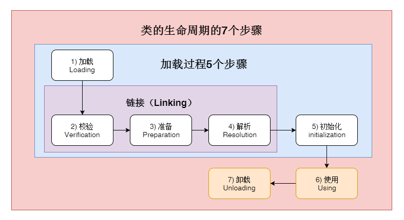
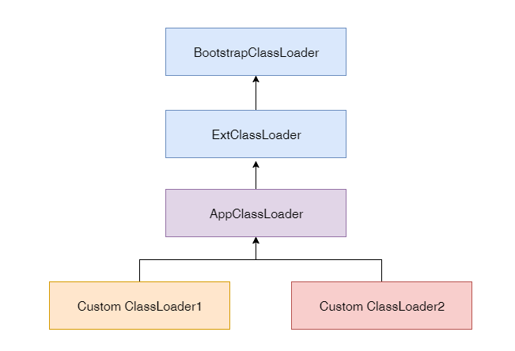
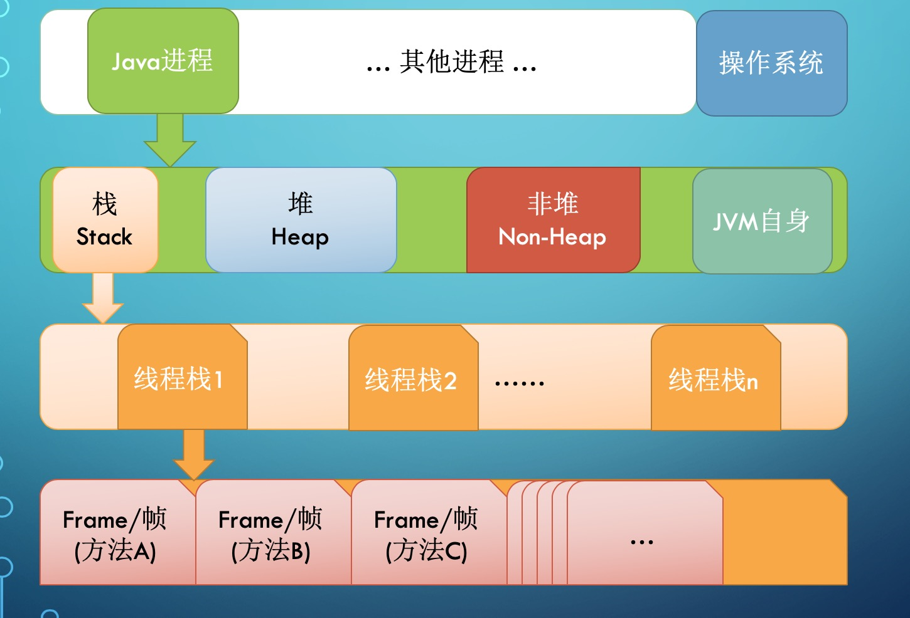
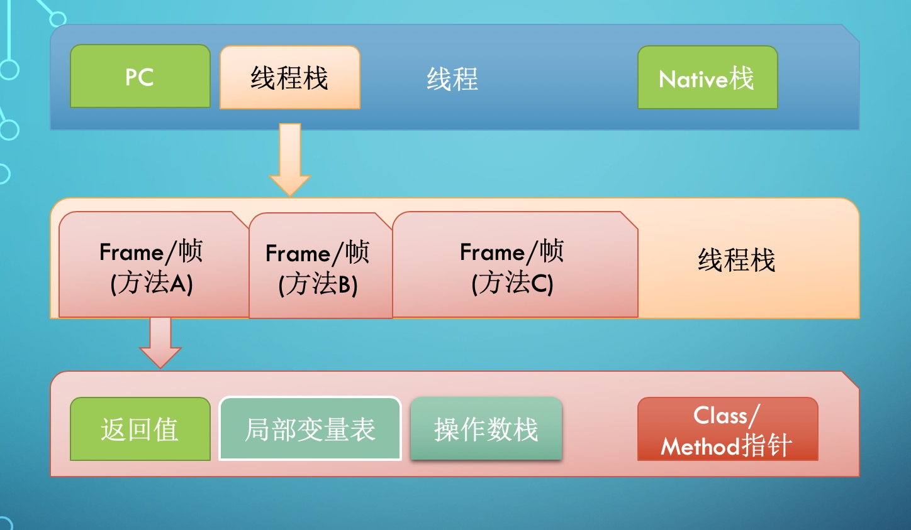
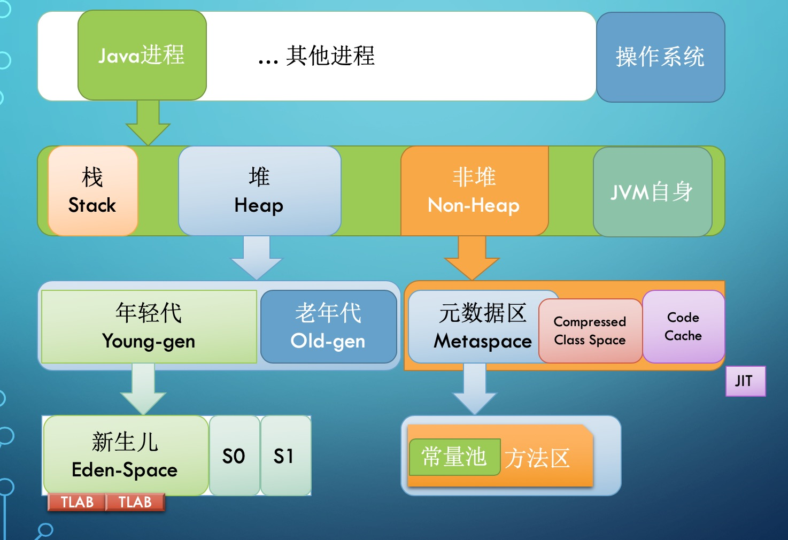
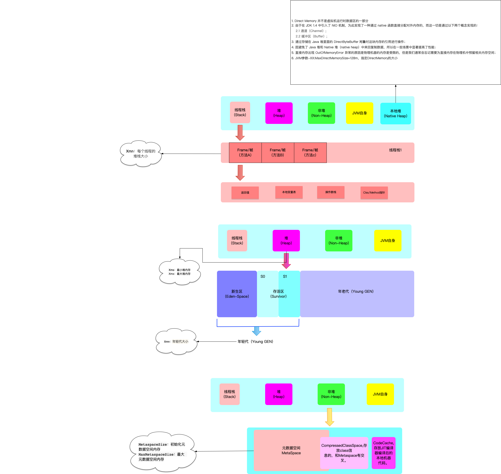
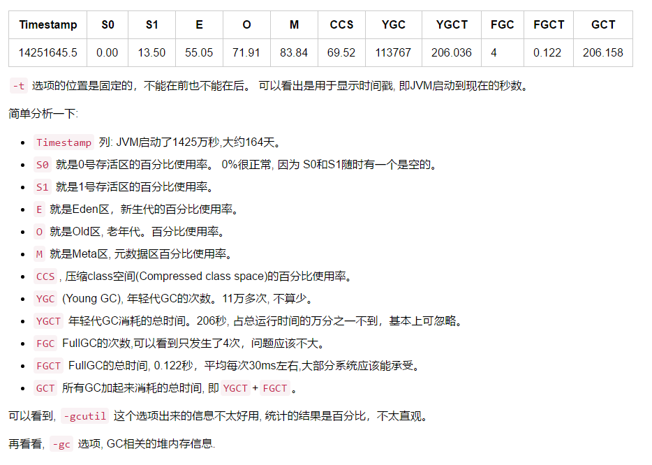
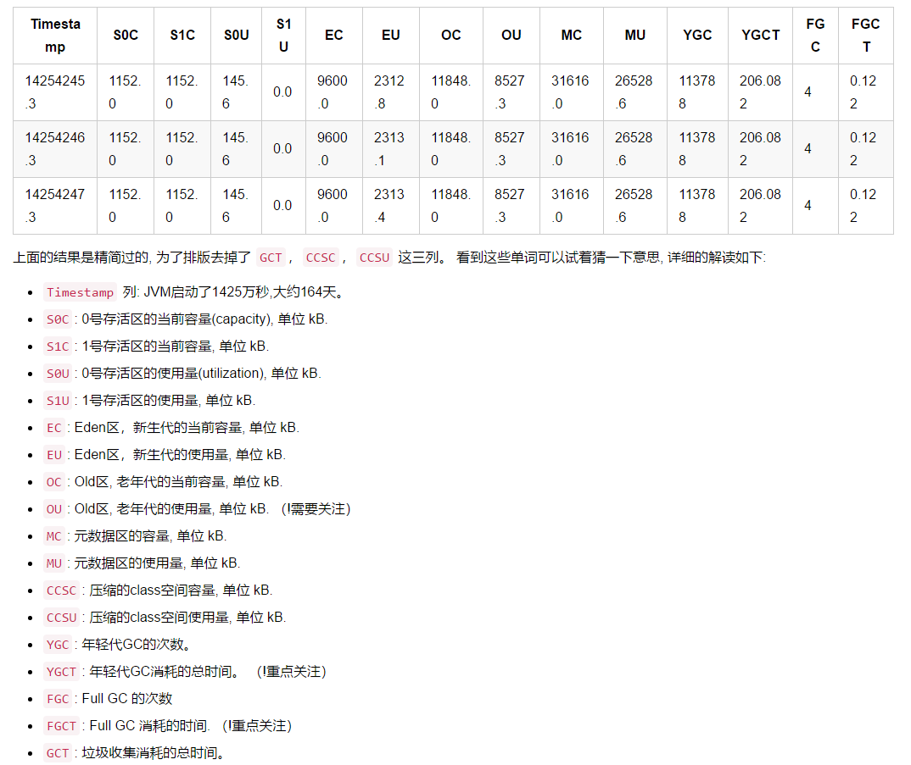

**作业见** *作业目录*

## 一. 字节码

### 1. 什么是字节码

> Javabytecode由单字节（byte）的指令组成，理论上最多支持256个操作码（opcode）。实际上Java只使用了200左右的操作码，还有一些操作码则保留给调试操作。

根据指令的性质，主要分为四个大类：
1.栈操作指令，包括与局部变量交互的指令2.程序流程控制指令
3.对象操作指令，包括方法调用指令
4.算术运算以及类型转换指令

### 2. 查看字节码

> javap -c -v demo.jvm0104.HelloByteCode

### 3. JVM运行时结构

> JVM是一台基于栈的计算机器。
每个线程都有一个独属于自己的线程栈（JVMStack），用于存储栈帧（Frame）。
每一次方法调用，JVM都会自动创建一个栈帧。
栈帧由操作数栈，局部变量数组以及一个Class引用组成。
Class引用指向当前方法在运行时常量池中对应的Class。

3.1 栈帧(Stack Frame)的局部变量表：存放方法参数和局部变量的内存区域。对于实例方法，slot0存储this，对于静态方法存储参数
>​ java数据类型包括：byte boolean char short int long float double reference(对象引用数据类型，是指向堆内存的引用)

3.2 栈帧(Stack Frame)的局部变量表中的最小单位为slot
> jvm规范中没有特定指定slot的大小，通常在32位操作系统中，slot占32位，此时long/double占两个slot。再64位操作系统中，slot占64位。所有数据类型都占1个slot。

### 4. JVM数据类型

Java是静态类型的，它会影响字节码指令的设计，这样指令就会期望自己对特定类型的值进行操作。例如，就会有好几个add指令用于两个数字相加：iadd、ladd、fadd、dadd。他们期望类型的操作数分别是int、long、float和double。大多数字节码都有这样的特性，它具有不同形式的相同功能，这取决于操作数类型。
JVM定义的数据类型包括:

1.  基本类型:
    数值类型: byte (8位), short (16位), int (32位), long (64-bit位), char (16位无符号Unicode), float(32-bit IEEE 754 单精度浮点型), double (64-bit IEEE 754 双精度浮点型)
    布尔类型
    指针类型: 指令指针。
2.  引用类型:
    类
    数组
    接口
在字节码中布尔类型的支持是受限的。举例来说，没有结构能直接操作布尔值。布尔值被替换转换成 int 是通过编译器来进行的，并且最终还是被转换成 int 结构。Java 开发者应该熟悉所有上面的类型，除了 returnAddress，它没有等价的编程语言类型。类数组接口在字节码中布尔类型的支持是受限的。举例来说，没有结构能直接操作布尔值。布尔值被替换转换成 int 是通过编译器来进行的，并且最终还是被转换成 int 结构。

Java 开发者应该熟悉所有上面的类型，除了 returnAddress，它没有等价的编程语言类型

### 5. 字节码助记符

https://blog.csdn.net/PacosonSWJTU/article/details/50600128

### 6. 参考文章

https://blog.csdn.net/a15089415104/article/details/83215598

https://zhuanlan.zhihu.com/p/81965927?from_voters_page=true

## 二. JVM加载器

### 1. 类的生命周期

1. 加载（Loading）：找Class文件
2. 验证（Verification）：验证格式、依赖
3. 准备（Preparation）：静态字段、方法表
4. 解析（Resolution）：符号解析为引用
5. 初始化（Initialization）：构造器、静态变量赋值、静态代码块6.使用（Using）
6. 卸载（Unloading）

### 2. 类的加载时机

1. 当虚拟机启动时，初始化用户指定的主类，就是启动执行的 main 方法所在的类；
2. 当遇到用以新建目标类实例的 new 指令时，初始化 new 指令的目标类，就是 new
一个类的时候要初始化；
3. 当遇到调用静态方法的指令时，初始化该静态方法所在的类；
4. 当遇到访问静态字段的指令时，初始化该静态字段所在的类；
5. 子类的初始化会触发父类的初始化；
6. 如果一个接口定义了 default 方法，那么直接实现或者间接实现该接口的类的初始化，
会触发该接口的初始化；
7. 使用反射 API 对某个类进行反射调用时，初始化这个类，其实跟前面一样，反射调用
要么是已经有实例了，要么是静态方法，都需要初始化；
8. 当初次调用 MethodHandle 实例时，初始化该 MethodHandle 指向的方法所在的
类。

### 3. 不会初始化（可能会加载）

1. 通过子类引用父类的静态字段，只会触发父类的初始化，而不会触发子类的初始化。
2. 定义对象数组，不会触发该类的初始化。
3. 常量在编译期间会存入调用类的常量池中，本质上并没有直接引用定义常量的类，不
会触发定义常量所在的类。
4. 通过类名获取 Class 对象，不会触发类的初始化，Hello.class 不会让 Hello 类初始
化。
5. 通过 Class.forName 加载指定类时，如果指定参数 initialize 为 false 时，也不会触
发类初始化，其实这个参数是告诉虚拟机，是否要对类进行初始化。Class.forName
（“jvm.Hello”）默认会加载 Hello 类。
6. 通过 ClassLoader 默认的 loadClass 方法，也不会触发初始化动作（加载了，但是
不初始化）。

### 4. 三类加载器
1. 启动类加载器（BootstrapClassLoader）
2. 扩展类加载器（ExtClassLoader）
3. 应用类加载器（AppClassLoader）

## 三. JVM内存模型

### 1. JVM内存结构

#### 1.1 JVM整体内存结构

>每启动一个线程，JVM 就会在栈空间栈分
配对应的 线程栈, 比如 1MB 的空间（-
Xss1m）。
线程栈也叫做 Java 方法栈。 如果使用了
JNI 方法，则会分配一个单独的本地方法栈
(Native Stack)。
线程执行过程中，一般会有多个方法组成调
用栈（Stack Trace）, 比如 A 调用 B，B 
调用 C。。。每执行到一个方法，就会创建
对应的 栈帧（Frame）。

#### 1.2 JVM 栈内存结构

>栈帧是一个逻辑上的概念，具体的大小在
 一个方法编写完成后基本上就能确定。
 比如返回值 需要有一个空间存放吧，每个
 局部变量都需要对应的地址空间，此外还
 有给指令使用的 操作数栈，以及 class 指
 针（标识这个栈帧对应的是哪个类的方法, 
 指向非堆里面的 Class 对象）。
 

 
#### 1.3 JVM 堆内存结构

>堆内存是所有线程共用的内存空间，JVM 将
 Heap 内存分为年轻代（Young generation）和 老年代（Old generation, 也叫 Tenured）两部分。
 年轻代还划分为 3 个内存池，新生代（Eden 
 space）和存活区（Survivor space）, 在大部分
 GC 算法中有 2 个存活区（S0, S1），在我们可
 以观察到的任何时刻，S0 和 S1 总有一个是空的, 但一般较小，也不浪费多少空间。
 Non-Heap 本质上还是 Heap，只是一般不归 GC
 管理，里面划分为 3 个内存池。
 Metaspace, 以前叫持久代（永久代, Permanent 
 generation）, Java8 换了个名字叫 Metaspace. 
 CCS, Compressed Class Space, 存放 class 信
 息的，和 Metaspace 有交叉。
 Code Cache, 存放 JIT 编译器编译后的本地机器
 代码。

### 2. JVM参数

* -Xmx, 指定最大堆内存。 如 -Xmx4g. 这只是限制了 Heap 部分的最大值为4g。
这个内存不包括栈内存，也不包括堆外使用的内存。
* -Xms, 指定堆内存空间的初始大小。 如 -Xms4g。 而且指定的内存大小，并
不是操作系统实际分配的初始值，而是GC先规划好，用到才分配。 专用服务
器上需要保持 –Xms 和 –Xmx 一致，否则应用刚启动可能就有好几个 FullGC。
当两者配置不一致时，堆内存扩容可能会导致性能抖动。
* -Xmn, 等价于 -XX:NewSize，使用 G1 垃圾收集器 不应该 设置该选项，在其
他的某些业务场景下可以设置。官方建议设置为 -Xmx 的 1/2 ~ 1/4.
* -XX：MaxPermSize=size, 这是 JDK1.7 之前使用的。Java8 默认允许的
Meta空间无限大，此参数无效。
* -XX：MaxMetaspaceSize=size, Java8 默认不限制 Meta 空间, 一般不允许设
置该选项。
* -XX：MaxDirectMemorySize=size，系统可以使用的最大堆外内存，这个参
数跟 -Dsun.nio.MaxDirectMemorySize 效果相同。
-Xss, 设置每个线程栈的字节数。 例如 -Xss1m 指定线程栈为 1MB，与-
* XX:ThreadStackSize=1m 等价

**详情请参考java命令参数文档: https://docs.oracle.com/en/java/javase/15/docs/specs/man/java.html**

*默认情况下，即启动时不指定任何参数*

1. 最大堆内存为物理机内存（>1g）的 1/4
2. 初始化堆内存为物理机内存(>1g)的 1/64 （new + old）
3. -XX:ParallelGCThreads=并行GC线程数 为物理机CPU逻辑线程数 <= 8 ? CPU逻辑线程数 ： CPU逻辑线程数 * 5/8+3

### 3. 参考文章

https://cloud.tencent.com/developer/article/1586341

### 四. JVM命令行工具

#### 1. 常用的几个命令
* jps/jinfo : 查看java进程
* jstat : 查看jvm内部gc相关信息
* jmap : 查看heap或类占用空间统计
* jstack : 查看线程信息
* jcmd : 执行jvm相关分析命令（整合命令）

### 2. 命令演示
>jstat -gcutil <pid> 1000 1000

>jstat -gc <pid> 1000 1000

#### 4. 工具汇总
 
1. IDEA插件jclasslib
2. JD-GUI Class to Java File: https://github.com/java-decompiler/jd-gui/releases
