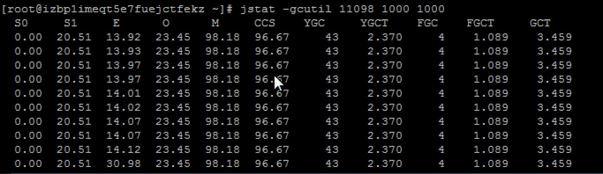

操作环境 机器是2核4G；Linux version 3.10.0-1062.12.1.el7.x86_64 (mockbuild@kbuilder.bsys.centos.org) (gcc version 4.8.5 20150623 (Red Hat 4.8.5-39) (GCC) ) #1 SMP Tue Feb 4 23:02:59 UTC 2020


java -heap

```
[root@izbp1imeqt5e7fuejctfekz ~]# jps -mlv
8837 org.apache.catalina.startup.Bootstrap start -Djava.util.logging.config.file=/opt/tomcat/conf/logging.properties -Djava.util.logging.manager=org.apache.juli.ClassLoaderLogManager  -Xms2048M -Xmx2048M -XX:SurvivorRatio=8 -XX:+UseParallelGC -XX:MaxMetaspaceSize=256M -Dfile.encoding=UTF-8 -Dcom.sun.management.jmxremote.port=8099 -Dcom.sun.management.jmxremote.ssl=false -Dcom.sun.management.jmxremote.authenticate=false -Djdk.tls.ephemeralDHKeySize=2048 -Djava.protocol.handler.pkgs=org.apache.catalina.webresources -Dignore.endorsed.dirs= -Dcatalina.base=/opt/tomcat -Dcatalina.home=/opt/tomcat -Djava.io.tmpdir=/opt/tomcat/temp

```

```
显式时，即启动参数指定 -XX:SurvivorRatio=8

[root@izbp1imeqt5e7fuejctfekz ~]# jmap -heap 11098
Attaching to process ID 11098, please wait...
Debugger attached successfully.
Server compiler detected.
JVM version is 25.181-b13

using thread-local object allocation.
Parallel GC with 2 thread(s)

Heap Configuration:
   MinHeapFreeRatio         = 0
   MaxHeapFreeRatio         = 100
   
   # 最大堆内存，-Xmx2048M
   MaxHeapSize              = 2147483648 (2048.0MB)
   
   # 初始化 Young Gen大小，设置堆内存比较小，启动后就达到最大啦
   NewSize                  = 715653120 (682.5MB)
   
   #Young Gen最大内存，NewRatio为2，即 2048.0MB * 1/3 = 682.67MB
   MaxNewSize               = 715653120 (682.5MB)
   
   # 设置JVM启动分配的老年代内存大小，类似于新生代内存的初始大小-XX:NewSize
   OldSize                  = 1431830528 (1365.5MB)
   
   #表示年轻代与年老代所占比值为1:2,年轻代占整个堆内存的1/3。在设置了-XX:MaxNewSize的情况下，-XX:NewRatio的值会被忽略，老年代的内存=堆内存 - 新生代内存。老年代的最大内存 = 堆内存 - 新生代 最大内存。
   NewRatio                 = 2
   
   # 设置新生代中1个Eden区与1个Survivor区的大小比值。在hotspot虚拟机中，新生代 = 1个Eden + 2个Survivor。如果新生代内存是10M，SurvivorRatio=8，那么Eden区占8M，2个Survivor区各占1M。
   SurvivorRatio            = 8
   
   
   MetaspaceSize            = 21807104 (20.796875MB)
   CompressedClassSpaceSize = 260046848 (248.0MB)
   MaxMetaspaceSize         = 268435456 (256.0MB)
   G1HeapRegionSize         = 0 (0.0MB)

Heap Usage:
PS Young Generation
Eden Space:
   
    # NewSize * 0.8 = 682.5MB * 0.8 = 546MB
    capacity = 573046784 (546.5MB)
    used     = 445442312 (424.80689239501953MB)
    free     = 127604472 (121.69310760498047MB)
    77.73227674199808% used
   
    From Space:
       capacity = 71303168 (68.0MB)
       used     = 4667488 (4.451263427734375MB)
       free     = 66635680 (63.548736572265625MB)
       6.5459756290211395% used
    To Space:
       capacity = 71303168 (68.0MB)
       used     = 0 (0.0MB)
       free     = 71303168 (68.0MB)
       0.0% used
    PS Old Generation
       capacity = 1431830528 (1365.5MB)
       used     = 331427584 (316.073974609375MB)
       free     = 1100402944 (1049.426025390625MB)
       23.147123735582205% used
```


jstat -gcutil pid 1000 1000



图中可以看出 FullGC 和 YoungGC  都比较耗时，FullGC每次272ms， YoungGC每次耗时545ms，这个属于测试环境，记录时特意重新啦服务，GC次数都比较小。
机器为2H4G，应用为线上使用版本，该性能用于测试应该足够

